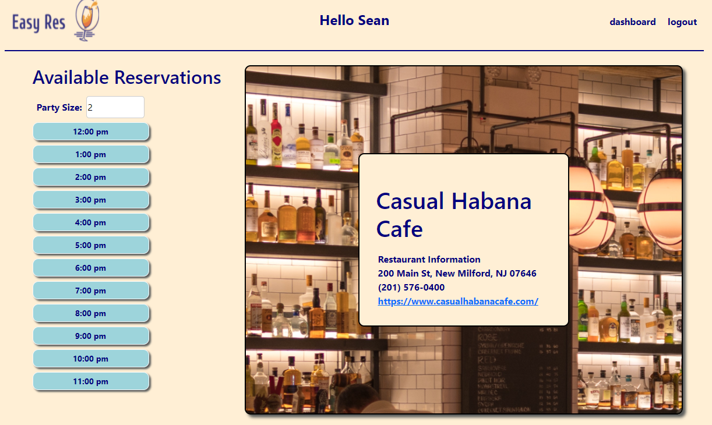

# Easy-Res

## Description
Easy Res is used to easily make reservations at your favorite restaurants. All you need to do is go to their page on the website and select your time and how many people are in your party. It will then send you a text conformation letting you know the reservation has been made. 

## Screenshot

## Link to site
https://easy-res.herokuapp.com/

## Credit
Robert Evanik: https://github.com/robjameva  
Chris Mccormack https://github.com/CmcCormack92  
Sean Gillespie https://github.com/seene3
